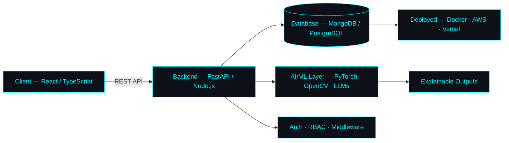

<div align="center">


<a href="https://github.com/Codesmashershubh">
  
</a>

<br/>


<br/><br/>

[](https://ss-website.netlify.app/)
[](https://www.linkedin.com/in/shubham-shukla-66b5a0378)
[](mailto:shubhamshukla122005@gmail.com)

</div>

<br/>

## `01` System Overview

```yaml
profile:
  name: Shubham Shukla
  role: Full Stack Developer · AI/ML Engineer · Software Developer
  focus: [Full-Stack Web Apps, Applied AI, LLM Systems, System Design]
  currently_learning: [AI Agents, RAG Pipelines, LLM Engineering, Cloud Deployment]
  currently_grinding: DSA + System Design for SDE interviews
  philosophy: "Ship real products, not tutorials."
```

<br/>

## `02` Tech Stack — Proficiency Matrix

<div align="center">

| Layer | Stack | Focus |
|---|---|---|
| **Languages** |  | `Python` `Java` `C++` `JS/TS` |
| **Frontend** |  | `React` `Vite` `Tailwind` |
| **Backend** |  | `FastAPI` `Node.js` `Express` |
| **AI / ML** |  | `PyTorch` `TensorFlow` `OpenCV` |
| **Data** |  | `MongoDB` `PostgreSQL` `Firebase` |
| **DevOps** |  | `Docker` `AWS` `Git/GitHub` `Linux` |
| **Tools** |  | `VS Code` `Postman` `Figma` |

</div>

<br/>

## `03` Architecture Philosophy



<br/>

## `04` Featured Builds

<table width="100%">
<tr>
<td width="50%" valign="top">

### 🧠 AI Resume Screener
**Explainable candidate-ranking engine**

`FastAPI` `React` `TypeScript` `NLP`

- Resume parsing pipeline
- Transparent scoring model
- Recruiter-facing dashboard

[`→ view source`](https://github.com/Codesmashershubh/Resume-Screener-Candidate-ranking-tool)

</td>
<td width="50%" valign="top">

### 📷 Face Attendance AI
**Real-time recognition & automation**

`React` `Node.js` `MongoDB` `Flask`

- Live face recognition engine
- Role-based access control
- Automated attendance logging

[`→ view source`](https://github.com/Codesmashershubh/Faceattend-AI)

</td>
</tr>
<tr>
<td width="50%" valign="top">

### 🛍️ VELOUR Commerce
**Full-stack storefront**

`JavaScript` `E-Commerce` `Responsive`

- Product catalog & cart system
- Checkout flow
- Fully responsive UI

[`→ view source`](https://github.com/Codesmashershubh/E-commerce-website)

</td>
<td width="50%" valign="top">

### 📅 Schedula
**Scheduling & booking platform**

`JavaScript` `Node.js` `Email API`

- Appointment scheduling engine
- Automated email confirmations
- Conflict-free booking logic

[`→ view source`](https://github.com/Codesmashershubh/Schedula)

</td>
</tr>
</table>

<br/>

## `05` Metrics Dashboard

<div align="center">


</div>

<br/>

## `06` Live Contribution Snake

<div align="center">


<sub>Auto-generated via the included <code>snake.yml</code> GitHub Action — see setup notes below</sub>

</div>

<br/>

## `07` Current Objectives

```diff
+ Build production-ready AI applications
+ Master full-stack architecture end-to-end
+ Contribute meaningfully to open source
! Crack top-tier SDE interviews — in progress
```

<br/>

<div align="center">


<sub>`shubhamshukla@dev` — <code>"Building software that solves real-world problems."</code></sub>

</div>
